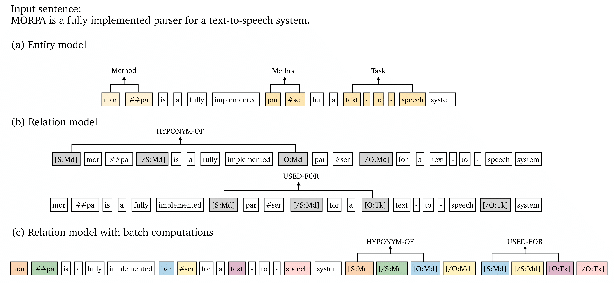

# PURE: Entity and Relation Extraction from Text

This repository contains  (PyTorch) code and pre-trained models for PURE (the **P**rinceton **U**niversity **R**elation **E**xtraction system), described by the paper: [A Frustratingly Easy Approach for Entity and Relation Extraction](https://arxiv.org/pdf/2010.12812.pdf).

## Quick links
* [Overview](#Overview)
* [Setup](#Setup)
  * [Install dependencies](#Install-dependencies)
  * [Data preprocessing](#Download-and-preprocess-the-datasets)
* [Quick Start](#Quick-start)
* [Entity Model](#Entity-Model)
  * [Input data format](#Input-data-format-for-the-entity-model)
  * [Train/evaluate the entity model](#Train/evaluate-the-entity-model)
* [Relation Model](#Relation-Model)
  * [Input data format](#Input-data-format-for-the-relation-model)
  * [Train/evaluate the relation model](#Train/evaluate-the-relation-model)
  * [Approximation relation model](#Approximation-relation-model)
* [Pre-trained Models](#Pre-trained-Models)
  * [Pre-trained models for ACE05](#Pre-trained-models-for-ACE05)
  * [Pre-trained models for SciERC](#Pre-trained-models-for-SciERC)
* [Bugs or Questions?](#Bugs-or-questions)
* [Citation](#Citation)

## Overview

In this work, we present a simple approach for entity and relation extraction. Our approach contains three conponents:

1. The **entity model** takes a piece of text as input and predicts all the entities at once.
2. The **relation model** considers every pair of entities independently by inserting typed entity markers, and predicts the relation type for each pair.
3. The **approximation relation model** supports batch computations, which enables efficient inference for the relation model.

Please find more details of this work in our [paper](https://arxiv.org/pdf/2010.12812.pdf).

## Setup

### Install dependencies
Please install all the dependency packages using the following command:
```
pip install -r requirements.txt
```

### Download and preprocess the datasets
Our experiments are based on three datasets: ACE04, ACE05, and SciERC. Please find the links and pre-processing below:
* ACE04/ACE05: We use the preprocessing code from [DyGIE repo](https://github.com/luanyi/DyGIE/tree/master/preprocessing). Please follow the instructions to preprocess the ACE05 and ACE04 datasets.
* SciERC: The preprocessed SciERC dataset can be downloaded in their project [website](http://nlp.cs.washington.edu/sciIE/).

## Quick Start
The following commands can be used to download the preprocessed SciERC dataset and run our pre-trained models on SciERC.

```bash
# Download the SciERC dataset
wget http://nlp.cs.washington.edu/sciIE/data/sciERC_processed.tar.gz
mkdir scierc_data; tar -xf sciERC_processed.tar.gz -C scierc_data; rm -f sciERC_processed.tar.gz
scierc_dataset=scierc_data/processed_data/json/

# Download the pre-trained models (single-sentence)
mkdir scierc_models; cd scierc_models

# Download the pre-trained entity model
wget https://nlp.cs.princeton.edu/projects/pure/scierc_models/ent-scib-ctx0.zip
unzip ent-scib-ctx0.zip; rm -f ent-scib-ctx0.zip
scierc_ent_model=scierc_models/ent-scib-ctx0/

# Download the pre-trained full relation model
wget https://nlp.cs.princeton.edu/projects/pure/scierc_models/rel-scib-ctx0.zip
unzip rel-scib-ctx0.zip; rm -f rel-scib-ctx0.zip
scierc_rel_model=scierc_models/rel-scib-ctx0/

# Download the pre-trained approximation relation model
wget https://nlp.cs.princeton.edu/projects/pure/scierc_models/rel_approx-scib-ctx0.zip
unzip rel_approx-scib-ctx0.zip; rm -f rel_approx-scib-ctx0.zip
scierc_rel_model_approx=scierc_models/rel_approx-scib-ctx0/

cd ..

# Run the pre-trained entity model, the result will be stored in ${scierc_ent_model}/ent_pred_test.json
python run_entity.py \
    --do_eval --eval_test \
    --context_window 0 \
    --task scierc \
    --data_dir ${scierc_dataset} \
    --model allenai/scibert_scivocab_uncased \
    --output_dir ${scierc_ent_model}

# Run the pre-trained full relation model
python run_relation.py \
  --task scierc \
  --do_eval --eval_test \
  --model allenai/scibert_scivocab_uncased \
  --do_lower_case \
  --context_window 0\
  --max_seq_length 128 \
  --entity_output_dir ${scierc_ent_model} \
  --output_dir ${scierc_rel_model}
  
# Output end-to-end evaluation results
python run_eval.py --prediction_file ${scierc_rel_model}/predictions.json

# Run the pre-trained approximation relation model (with batch computation)
python run_relation_approx.py \
  --task scierc \
  --do_eval --eval_test \
  --model allenai/scibert_scivocab_uncased \
  --do_lower_case \
  --context_window 0\
  --max_seq_length 250 \
  --entity_output_dir ${scierc_ent_model} \
  --output_dir ${scierc_rel_model_approx} \
  --batch_computation

# Output end-to-end evaluation results
python run_eval.py --prediction_file ${scierc_rel_model_approx}/predictions.json
```

## Entity Model

### Input data format for the entity model

The input data format of the entity model is JSONL. Each line of the input file contains one document in the following format.
```
{
  # document ID (please make sure doc_key can be used to identify a certain document)
  "doc_key": "CNN_ENG_20030306_083604.6",

  # sentences in the document, each sentence is a list of tokens
  "sentences": [
    [...],
    [...],
    ["tens", "of", "thousands", "of", "college", ...],
    ...
  ],

  # entities (boundaries and entity type) in each sentence
  "ner": [
    [...],
    [...],
    [[26, 26, "LOC"], [14, 14, "PER"], ...], #the boundary positions are indexed in the document level
    ...,
  ],

  # relations (two spans and relation type) in each sentence
  "relations": [
    [...],
    [...],
    [[14, 14, 10, 10, "ORG-AFF"], [14, 14, 12, 13, "ORG-AFF"], ...],
    ...
  ]
}
```

### Train/evaluate the entity model

You can use `run_entity.py` with `--do_train` to train an entity model and with `--do_eval` to evaluate an entity model.
A trianing command template is as follow:
```bash
python run_entity.py \
    --do_train --do_eval [--eval_test] \
    --learning_rate=1e-5 --task_learning_rate=5e-4 \
    --train_batch_size=16 \
    --context_window {0 | 100 | 300} \
    --task {ace05 | ace04 | scierc} \
    --data_dir {directory of preprocessed dataset} \
    --model {bert-base-uncased | albert-xxlarge-v1 | allenai/scibert_scivocab_uncased} \
    --output_dir {directory of output files}
```
Arguments:
* `--learning_rate`: the learning rate for BERT encoder parameters.
* `--task_learning_rate`: the learning rate for task-specific parameters, i.e., the classifier head after the encoder.
* `--context_window`: the context window size used in the model. `0` means using no contexts. In our cross-sentence entity experiments, we use `--context_window 300` for BERT models and SciBERT models and use `--context_window 100` for ALBERT models.
* `--model`: the base transformer model. We use `bert-base-uncased` and `albert-xxlarge-v1` for ACE04/ACE05 and use `allenai/scibert_scivocab_uncased` for SciERC.
* `--eval_test`: whether evaluate on the test set or not.

The predictions of the entity model will be saved as a file (`ent_pred_dev.json`) in the `output_dir` directory. If you set `--eval_test`, the predictions (`ent_pred_test.json`) are on the test set. The prediction file of the entity model will be the input file of the relation model.

## Relation Model
### Input data format for the relation model
The input data format of the relation model is almost the same as that of the entity model, except that there is one more filed `."predicted_ner"` to store the predictions of the entity model.
```bash
{
  "doc_key": "CNN_ENG_20030306_083604.6",
  "sentences": [...],
  "ner": [...],
  "relations": [...],
  "predicted_ner": [
    [...],
    [...],
    [[26, 26, "LOC"], [14, 15, "PER"], ...],
    ...
  ]
}
```

### Train/evaluate the relation model:
You can use `run_relation.py` with `--do_train` to train a relation model and with `--do_eval` to evaluate a relation model. A trianing command template is as follow:
```bash
python run_relation.py \
  --task {ace05 | ace04 | scierc} \
  --do_train --train_file {path to the training json file of the dataset} \
  --do_eval [--eval_test] [--eval_with_gold] \
  --model {bert-base-uncased | albert-xxlarge-v1 | allenai/scibert_scivocab_uncased} \
  --do_lower_case \
  --train_batch_size 32 \
  --eval_batch_size 32 \
  --learning_rate 2e-5 \
  --num_train_epochs 10 \
  --context_window {0 | 100} \
  --max_seq_length {128 | 228} \
  --entity_output_dir {path to output files of the entity model} \
  --output_dir {directory of output files}
```
Aruguments:
* `--eval_with_gold`: whether evaluate the model with the gold entities provided.
* `--entity_output_dir`: the output directory of the entity model. The prediction files (`ent_pred_dev.json` or `ent_pred_test.json`) of the entity model should be in this directory.

The prediction results will be stored in the file `predictions.json` in the folder `output_dir`, and the format will be almost the same with the output file from the entity model, except that there is one more field `"predicted_relations"` for each document.

You can run the evaluation script to output the end-to-end performance  (`Ent`, `Rel`, and `Rel+`) of the predictions.
```bash
python run_eval.py --prediction_file {path to output_dir}/predictions.json
```

### Approximation relation model
You can use the following command to train an approximation model.
```bash
python run_relation_approx.py \
 --task {ace05 | ace04 | scierc} \
 --do_train --train_file {path to the training json file of the dataset} \
 --do_eval [--eval_with_gold] \
 --model {bert-base-uncased | allenai/scibert_scivocab_uncased} \
 --do_lower_case \
 --train_batch_size 32 \
 --eval_batch_size 32 \
 --learning_rate 2e-5 \
 --num_train_epochs 10 \
 --context_window {0 | 100} \
 --max_seq_length {128 | 228} \
 --entity_output_dir {path to output files of the entity model} \
 --output_dir {directory of output files}
```

Once you have a trained approximation model, you can enable efficient batch computation during inference with `--batch_computation`:
```bash
python run_relation_approx.py \
 --task {ace05 | ace04 | scierc} \
 --do_eval [--eval_test] [--eval_with_gold] \
 --model {bert-base-uncased | allenai/scibert_scivocab_uncased} \
 --do_lower_case \
 --eval_batch_size 32 \
 --context_window {0 | 100} \
 --max_seq_length 250 \
 --entity_output_dir {path to output files of the entity model} \
 --output_dir {directory of output files} \
 --batch_computation
```
*Note*: the current code does not support approximation models based on ALBERT.

## Pre-trained Models
We release our pre-trained entity models and relation models for ACE05 and SciERC datasets.

*Note*: the performance of the pre-trained models might be slightly different from the reported numbers in the paper, since we reported the average numbers based on multiple runs.


### Pre-trained models for ACE05
**Entity models**:
* [BERT (single, W=0)](https://nlp.cs.princeton.edu/projects/pure/ace05_models/ent-bert-ctx0.zip) (388M): Single-sentence entity model based on `bert-base-uncased`
* [ALBERT (single, W=0)](https://nlp.cs.princeton.edu/projects/pure/ace05_models/ent-alb-ctx0.zip) (793M): Single-sentence entity model based on `albert-xxlarge-v1`
* [BERT (cross, W=300)](https://nlp.cs.princeton.edu/projects/pure/ace05_models/ent-bert-ctx300.zip) (388M): Cross-sentence entity model based on `bert-base-uncased`
* [ALBERT (cross, W=100)](https://nlp.cs.princeton.edu/projects/pure/ace05_models/ent-alb-ctx100.zip) (793M): Cross-sentence entity model based on `albert-xxlarge-v1`

**Relation models**:
* [BERT (single, W=0)](https://nlp.cs.princeton.edu/projects/pure/ace05_models/rel-bert-ctx0.zip) (387M): Single-sentence relation model based on `bert-base-uncased`
* [BERT-approx (single, W=0)](https://nlp.cs.princeton.edu/projects/pure/ace05_models/rel_approx-bert-ctx0.zip) (387M): Single-sentence approximation relation model based on `bert-base-uncased`
* [ALBERT (single, W=0)](https://nlp.cs.princeton.edu/projects/pure/ace05_models/rel-alb-ctx0.zip) (789M): Single-sentence relation model based on `albert-xxlarge-v1`
* [BERT (cross, W=100)](https://nlp.cs.princeton.edu/projects/pure/ace05_models/rel-bert-ctx100.zip) (387M): Cross-sentence relation model based on `bert-base-uncased`
* [BERT-approx (cross, W=100)](https://nlp.cs.princeton.edu/projects/pure/ace05_models/rel_approx-bert-ctx100.zip) (387M): Crosss-sentence approximation relation model based on `bert-base-uncased`
* [ALBERT (cross, W=100)](https://nlp.cs.princeton.edu/projects/pure/ace05_models/rel-alb-ctx100.zip) (789M): Cross-sentence relation model based on `albert-xxlarge-v1`

**Performance of pretrained models on ACE05 test set**:
* BERT (single)
```
NER - P: 0.890260, R: 0.882944, F1: 0.886587
REL - P: 0.689624, R: 0.652476, F1: 0.670536
REL (strict) - P: 0.664830, R: 0.629018, F1: 0.646429
```
* BERT-approx (single)
```
NER - P: 0.890260, R: 0.882944, F1: 0.886587
REL - P: 0.678899, R: 0.642919, F1: 0.660419
REL (strict) - P: 0.651376, R: 0.616855, F1: 0.633646
```
* ALBERT (single)
```
NER - P: 0.900237, R: 0.901388, F1: 0.900812
REL - P: 0.739901, R: 0.652476, F1: 0.693444
REL (strict) - P: 0.698522, R: 0.615986, F1: 0.654663
```
* BERT (cross)
```
NER - P: 0.902111, R: 0.905405, F1: 0.903755
REL - P: 0.701950, R: 0.656820, F1: 0.678636
REL (strict) - P: 0.668524, R: 0.625543, F1: 0.646320
```
* BERT-approx (cross)
```
NER - P: 0.902111, R: 0.905405, F1: 0.903755
REL - P: 0.684448, R: 0.657689, F1: 0.670802
REL (strict) - P: 0.659132, R: 0.633362, F1: 0.645990
```
* ALBERT (cross)
```
NER - P: 0.911111, R: 0.905953, F1: 0.908525
REL - P: 0.748521, R: 0.659427, F1: 0.701155
REL (strict) - P: 0.723866, R: 0.637706, F1: 0.678060
```

### Pre-trained models for SciERC
**Entity models**:
* [SciBERT (single, W=0)](https://nlp.cs.princeton.edu/projects/pure/scierc_models/ent-scib-ctx0.zip) (391M): Single-sentence entity model based on `allenai/scibert_scivocab_uncased`
* [SciBERT (cross, W=300)](https://nlp.cs.princeton.edu/projects/pure/scierc_models/ent-scib-ctx300.zip) (391M): Cross-sentence entity model based on `allenai/scibert_scivocab_uncased`

**Relation models**:
* [SciBERT (single, W=0)](https://nlp.cs.princeton.edu/projects/pure/scierc_models/rel-scib-ctx0.zip) (390M): Single-sentence relation model based on `allenai/scibert_scivocab_uncased`
* [SciBERT-approx (single, W=0)](https://nlp.cs.princeton.edu/projects/pure/scierc_models/rel_approx-scib-ctx0.zip) (390M): Single-sentence approximation relation model based on `allenai/scibert_scivocab_uncased`
* [SciBERT (cross, W=100)](https://nlp.cs.princeton.edu/projects/pure/scierc_models/rel-scib-ctx100.zip) (390M): Cross-sentence relation model based on `allenai/scibert_scivocab_uncased`
* [SciBERT-approx (cross, W=100)](https://nlp.cs.princeton.edu/projects/pure/scierc_models/rel_approx-scib-ctx100.zip) (390M): Cross-sentence approximation relation model based on `allenai/scibert_scivocab_uncased`

**Performance of pretrained models on SciERC test set**:
* SciBERT (single)
```
NER - P: 0.667857, R: 0.665875, F1: 0.666865
REL - P: 0.491614, R: 0.481520, F1: 0.486515
REL (strict) - P: 0.360587, R: 0.353183, F1: 0.356846
```
* SciBERT-approx (single)
```
NER - P: 0.667857, R: 0.665875, F1: 0.666865
REL - P: 0.500000, R: 0.453799, F1: 0.475780
REL (strict) - P: 0.376697, R: 0.341889, F1: 0.358450
```
* SciBERT (cross)
```
NER - P: 0.676223, R: 0.713947, F1: 0.694573
REL - P: 0.494797, R: 0.536961, F1: 0.515017
REL (strict) - P: 0.362346, R: 0.393224, F1: 0.377154
```
* SciBERT-approx (cross)
```
NER - P: 0.676223, R: 0.713947, F1: 0.694573
REL - P: 0.483366, R: 0.507187, F1: 0.494990
REL (strict) - P: 0.356164, R: 0.373717, F1: 0.364729
```

## Bugs or Questions?
If you have any questions related to the code or the paper, feel free to email Zexuan Zhong `(zzhong@cs.princeton.edu)`. If you encounter any problems when using the code, or want to report a bug, you can open an issue. Please try to specify the problem with details so we can help you better and quicker!

## Citation
If you use our code in your research, please cite our work:
```bibtex
@inproceedings{zhong2021frustratingly,
   title={A Frustratingly Easy Approach for Entity and Relation Extraction},
   author={Zhong, Zexuan and Chen, Danqi},
   booktitle={North American Association for Computational Linguistics (NAACL)},
   year={2021}
}
```
